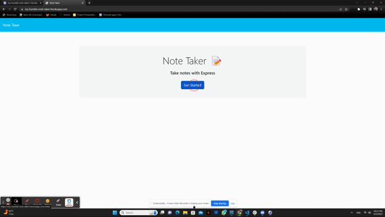

# my-humble-note-taker
[](https://opensource.org/licenses/MIT)

## Description

This week, I was tasked in connecting an application that was created to write and save notes with a backend tool, known as Express JS. Where the frontend code of this application was provided, I was tasked in connnection those code with my backend code so they can react with the requests (GET, POST, and DELETE) and implements an imitation database using a JSON file to store and retrieve data. 

## Table of Contents

* [Installation](#installation)
* [Usage](#usage)
* [License](#license)
* [Questions](#questions)

## Installation

This application requires the user to download node.js v16+ and is built from Express JS.

To install the dependency required for this repo, you will first need to run the command in the terminal :

```
npm install 
```

## Usage

* Access this live app through the deployed [Heroku link](https://my-humble-note-taker.herokuapp.com/). 
* Click on the blue button "Get Started".
* Type a new note title and note text in the input. 
* Click the 'save' icon to save the note. 
* Access the saved notes, select a note in the list located on the left. 
* Click the red trash to delete a saved note. 



[Preview](https://drive.google.com/file/d/1hRwuJZ5nzLmlwMaLormmA4u0TPeF48SG/view)

## License

[MIT License](https://opensource.org/licenses/MIT)

### Questions

[Review my other projects on GitHub.](https://www.github.com/slmov215)

[Email me](mailto:slmov215@gmail.com) 